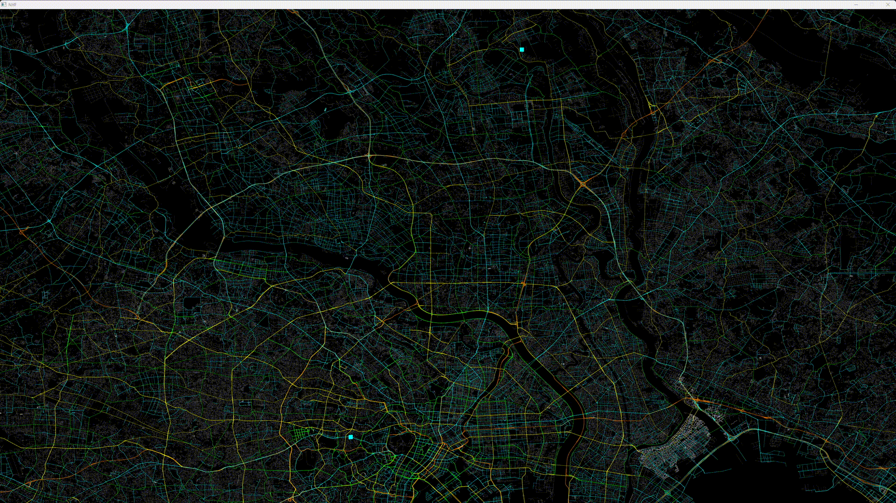

# Prog2 NHF



## Leírás

A program egy útvonaltervező, melynek célja a tervezéshez használt algoritmusok és adatstruktúrák karakterisztikáinak ismertetése és látványos, kézzel fogható példával való szemléltetése.

### Futtatás

A projekt cmake-et használ. A cmake FetchContent funkcióját használva le tudja tölteni és előállítani az OpenGL, GLM és GLFW3 függőségeket.

```sh
# cmake konfiguráció:
cd build && cmake ..
# hiba esetén lehetséges, hogy a GLAD cmake verziója miatt az alábbi szükséges:
cmake .. -DCMAKE_POLICY_VERSION_MINIMUM=3.5
# build
cmake --build ./build
# futtatás:
./build/NHF # ...args

```

### Használat

A program indításakor a paramétereket command line argument-ekként tudjuk megadni. A lehetséges paraméterek és leírásaik:

##### `--start <location>`

A kiindulási pont megadása. Ennek két féle formátuma lehet; egy koordináta `47.4733817,19.0572901` formátumban, vagy DMS-ben: `47°27'18.9"N 19°07'33.1"E` (ez könnyedén másolható Google Mapsből például) - ekkor a program a betöltött térkép útjain megkeresi a megadott ponthoz legközelebb eső koordinátát és onnan tervez utat.

##### `--destination <location>`

A célpont megadása. Ugyanúgy működik, mint a kiindulási pontnál.

##### `--map <path/to/map.geojsonl>`

A térkép betöltése. Elvárt formátum: [newline-delimited](https://www.interline.io/blog/geojsonl-extracts/) [geojson](https://datatracker.ietf.org/doc/html/rfc8142). Tipp: sok nagyváros térképe letölthető erről a weboldalról (de egy filterelt Budapest térképet mindenképp biztosítok egy drive linken keresztül): [OSM metro extracts](https://app.interline.io/osm_extracts/interactive_view).

A fájlok itt találhatóak: https://drive.google.com/drive/folders/1m7llz3DAKNm-KzY55OFMy2f6AHYZOiCU?usp=sharing _(bme.roads.geojsonl -> egyetem és környéke, budapest.roads.geojsonl -> Budapest szíve, budapest_hungary.roads.geojsonl -> Budapest és tág értelemben vett környéke)_

##### `--algo <astar|dijkstra|bfs|dfs>`

A kiválasztott gráfbejáró algoritmus. Implementált algoritmusok: [A\* search](https://en.wikipedia.org/wiki/A*_search_algorithm), [Dijkstra](https://en.wikipedia.org/wiki/Dijkstra%27s_algorithm), [DFS](https://en.wikipedia.org/wiki/Depth-first_search), [BFS](https://en.wikipedia.org/wiki/Breadth-first_search)

##### `--struct <list|matrix>`

A gráf reprezentációjához kiválasztott adatstruktúra. Lehetséges értékek: szomszédsági mátrix, vagy lista.

##### `--route-rate <ticks/sec>`

A végleges útvonalterv animációjának sebessége lépés/másodperc egységben megadva.

##### `--trace-rate <ticks/sec>`

Az algoritmus által bejárt élek animációjának sebessége lépés/másodperc egységben megadva.

##### `--route <shortest|fastest|custom>`

A gráf élsúlyainak kiszámítására használt módszer. A `shortest` opciót választva a program egyszerűen a legrövidebb utat keresi meg. A `fastest` esetében pedig (amennyiben a térképadatok ezt megengedik), a sebességhatárt, és egyéb útadatokat is figyelembe vesz.
A custom lehetőséget ad a felhasználónak arra, hogy önmaga próbálja hangolni az útvonaltervezéshez használt súlyokat. Ezeknek beállíŧása a `--config` kapcsolóval lehetséges.

##### `--config <a,b,c,d,e,f,g>`

A gráf élsúlyainak kiszámítására használt szorzók. A lényeg az, hogy minél magasabb a súlyösszeg, annál valószínűbb, hogy elkerüli a keresőalgoritmus. Magyarázat:

-   `a`: a sebességgel fordítottan arányos súly szorzója

-   `b`: az él bejárásához szükséges idő szorzója (másodpercben). Elég jó iránymutató.

-   `c`: az él hosszának szorzója (méterben). Elég jó irányadó.

-   `d`: a kanyarok ára/büntetése - ez az érték a kanyar élességével arányosan van hozzáadva a súlyhoz. Ezt érdemes a százezres nagyságrendekbe emelni, mivel az algoritmus hajlamos felesleges kanyarokat tenni látszólag értelmetlenül.

-   `e`: az autóval nem bejárható utak súlyértéke.

-   `f`: az út rangjával fordítottan arányos súly (legmagasabb rang: országút, legalacsonyabb: sima utak - a rank exponenciálisan nő).

-   `g`: a fizetős utakra vonatkozó büntetőérték.

##### `--help`

Használati útmutató kiírása.

---

### A program működése

**1. Parancssori argumentumok feldolgozása**

```cpp
cli::Options options = cli::parse(argc, argv);
```

A program bemeneti paramétereit (`argc`, `argv`) feldolgozza, és a `cli::Options` nevű struktúrában tárolja. Ez tartalmazza például a bemeneti térképfájl helyét, az algoritmus típusát, kezdő és célpont koordinátákat stb.

**2. Adatok betöltése és gráf felépítése**

```cpp
std::vector<Road *> roads = loader::from_file(options.map);
DiGraph<Node> graph = loader::construct(roads, options);
```

**Fájlbetöltés**: Beolvassa az úthálózatot egy `.geojsonl` fájlból. A program alapesetben cache-t használ: ha sikeresen beolvasta a geojson fájlból az adatokat, akkor a `Serializable` osztály implementálásával elmenti egy `<filename>.cache.bin` bináris fáljban, amit következő beolvasásnál használ. Ez drasztikusan csökkenti a betöltési időt (egy 200MB-os fájl esetében 30 sec -> ~200ms).
A `geojsonl` beolvasása reguláris kifejezésekkel működik. Nem a leggyorsabb, de működik. Van hozzá egy `as_stream` template helper függvény, amely egy string-ből egy adott típust tud előállítani, amennyiben az insert operator implementálva van rá.
A `Road` osztály OSM adatokat tartalmaz egy adott szegmensről, illetve neki a feladata a `Point` koordináták tárolása illetve felszabadítása.

**Gráfépítés**: Az úthálózati adatokból egy irányított gráfot (`DiGraph`) épít. Először összeköti a egy LineString-en belüli szegmenseket. Az utak keresztezéséhez egy Hashmap-et használ: a `Point` struktúra implementálja a `Hashable` virtuális alaposztályt, aminek segítségével az egy helyre mutató pontokhoz tartozó azonosítók egy vector-ba kerülnek. Ezzel `O(n)` időben megkereshetőek a kereszteződések. A `Node` struktúra két pointert tartalmaz: egy one-to-one kapcsolat egy `Point` objektummal, illetve a hozzá tartozó `Road` mutatóját. Az útvonaltervezés során ez lesz a gráf által tárolt alaptípus.
A `DiGraph` osztály egy irányított gráfot reprezentál. A konstruktorában megadható, hogy milyen struktúrát kíván a felhasználó használni (szomszédsági lista vagy mátrix). A mátrix esetében nagy térképek esetében könnyen elképzelhető, hogy nem fér bele a memóriába, ezért a program megkérdezi a user-t egy memória-foglalás becsléssel, hogy biztosan folytatni kívánja-e.
A két gráffajta - `MGraph` és `LGraph` -alaposztálya a `GraphRepresentation<T>` ős. Fontosabb virtuális függvényei az `adjacent`, `edge`, `b_edge`.

**3. Kezdő- és célpont meghatározása**
Ha a felhasználó nem adott meg különböző kezdő- és célpontot, véletlenszerűen választ kettőt, egyébként egyszerű lineáris kereséssel megkeresi a térképen legközelebbi pontokat a megadott koordinátákhoz.

**4. Útvonaltervező algoritmus kiválasztása és futtatása**

```cpp
Weight<Node> *weight = create(options.routing, options.coeffs);
Algorithm<Node> *algo = algoselect(options.algorithm, graph, weight);

algo->run(source, target, true);
std::vector<int> path = algo->reconstruct(source, target);
```

A kiválasztott súlyozási séma (`Weight`) és algoritmus (`Algorithm`, pl. Dijkstra, A\*) kerül alkalmazásra. Az algoritmus lefuttatása után visszaadja az optimális útvonalat (path).
Az `Algorithm` ősnek 4 gyerekosztálya van: `Dijsktra`, `AStar`, `BFS` és `DFS`. A `run` virtuális függvényt implementálják. A súlyozás a gyerekosztályokban van tárolva, hiszen `BFS` és `DFS` esetében nincs szükség ilyesmire. (megjegyezném hogy a DFS abszolút nem való rövid/értelmes útkeresésre, de felettébb szórakoztató az animációja).
A `Counter` osztály tagfüggvényeit minden algoritmus használja. Ennek a feladata a lépések számlálása. 3 mérce van: a memóriaműveletek száma, az elágazások száma és az általános lépések száma. A `diagnostics.h` fájlban található egy `Sizable` absztrakt osztály - egy `size_of` virtuális tagfüggvénnyel. Ezzel a különféle adatstruktúrák (gráftípusok és algoritmusok) tudnak egy becslést adni a lefoglalt memóriára. A kiértékelés során ez mind ki van írva.
Az algoritmus a technikai adatok mellett megjeleníti az útvonal hosszát és az utazási időt is.

**7. Vizualizáció**

```cpp
Network network = Network(graph, roads);
network.run(*algo, path, target, source);
```

A `Network` osztály tartalmazza asszociációs kapcsolatban van a `Map` osztállyal.
A `Map` osztály a `Window` ős gyereke, amely egy "wrapper" szerepet tölt be az `opengl` körül.

**Event handling**: az eseménykezelésre egy `EventHandler` virtuális osztály szolgál, amelynek 4 tagfüggvénye kezeli a billenyűzet, kurzor, scroll és kattintás eseményeket. A Zoom és Drag osztályok ezt implementálják. Ezeket egy Panzoom osztály fogja össze, amely szintén implementálja az `EventHandler` osztályt valamint a `Gesture`-t. A gesture absztrakt osztálynak a virtuális tagfüggvénye egy adott `glm::mat4 view` mátrixot transzformál. Így görgetésre és mozgatásra az elvárt módon reagál a kirajzolt kép.

**Rendering**: az objektumok kirajzolását a `Drawable` osztály segíti - ez tartalmazza az opengl-lel való rajzolás alapvető elemeit, mint például a vertex buffer. A leszármazottjai a `PolyLine` és `DPoint` osztályok - előbbi vonalakat, utóbbi pontokat rajzol a képernyőre. A vonalak megjelenését a `Shader` osztály szabályozza. GLSL nyelven írt vertex és fragment (esetleg geometry) shader-eket fog össze, compile-ol, link-el és kiírja az esetleges hibaüzeneteket. A térképhez tartozó `PolyLine` shader-jében például a renderelés hatékonysága úgy lett megoldva, hogy bizonyos zoom level alatt a kevésbe fontos utatkat fokozatosan elhalványítja, majd eldobja.

**Térkép**: A `Map` osztály 3 `PolyLine` objektumtagot tárol. Egy a térképet rajzolja ki, egy az algoritmus által bejárt útvonalakat, egy pedig egy vastagított vonallal rajzolja ki a megtervezett utat. Az animáció egy callback-kel van megoldva (`std::function`). A `Map` minden képfrissítéskor meghívja ezt a callback-et, amiben az algoritmus által bejárt élek (`Trace`) és útvonalterv (`path`) elemei n-darabonként vannak hozzáadva a `Drawable` osztályok bufferjéhez.
A space billenyű megnyomásával az animáció elindítható/megállítható (ilyenkor nem fut le a callback).
A callback a `Network` osztályban van definiálva, amely összefogja a választott algoritmust és a térképet. A `Network::setup` függvény hozzáadja a `map.geo_roads` rajzolható `PolyLine`-hoz a gráf éleit. Illetve egy bounding box-ot csinál a teljes ponthalmaz körül. Ezután a `Panzoom` értékét úgy állítja be, hogy betöltéskor a felhasználót a térkép közepe fogadja. A `Network::run` függvény indítja el a grafikus részét a programnak (`map.loop` meghívásával), és animálja meg a fentebb leírt módon.

---

Bővebb részletek és UML diagramok megtekinthetőek a Doxygen által generált dokumentációban.
